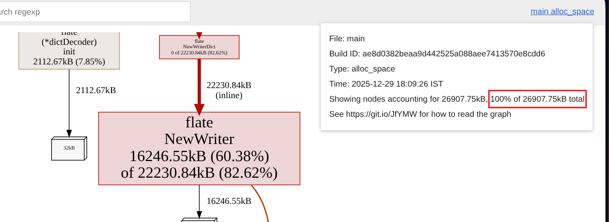
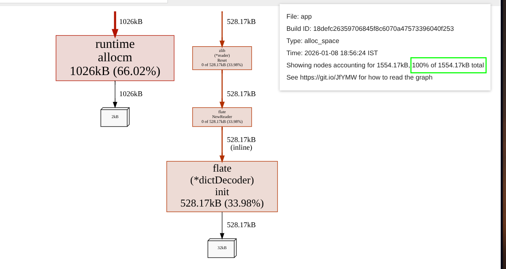
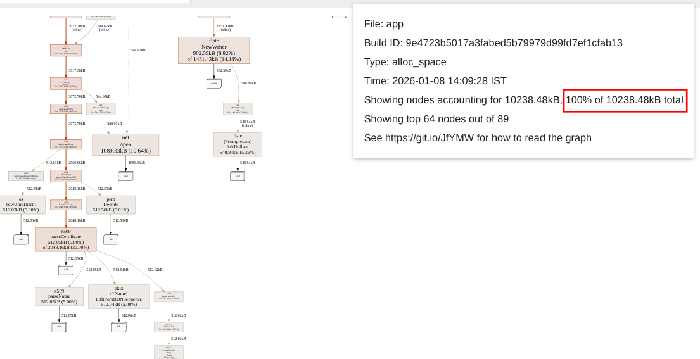
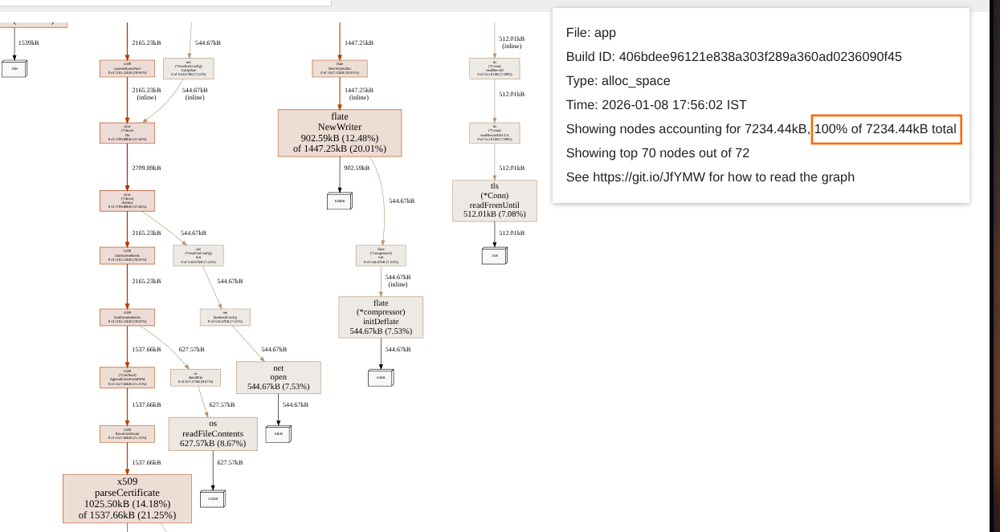

# git-subset-go

> **Full disclosure: The following README was mostly written using ai with the following prompt:**
> *can you write a readme for [https://github.com/mviswanathsai/git-subset-go/tree/master](https://github.com/mviswanathsai/git-subset-go/tree/master)? The context
is that I wrote this as part of the code-crafters git challenge. I want the focus to mainly be on the verify-pack, and clone sub-commands. note that since this was a personal proejct and I wasn't keen on the error handling, it is kind of inconsistent, to say the least. The main difference here is that the verify-pack runs without an idx file. It essentially just streams the packfile twice. Once, to make an internal representation of the objects. 2nd tiime, to create the objects (inflate the deltified objects), summarize and print the object stats. The clone is essentially the same. It negotiates for the packfile, streams it to create an IR, then uses that IR to create objects and write them to storage. Then, we checkout the head commit and recursively build the directory. Instead of reading from the written objects we wrote to disk, we make use of the IR of the objects we have during our 2nd run. This is fast, but memory heavy. An alternate and more efficient approach would be to read from disk, but I had to freedom to do what I want, so yeah. I have also attached some of the graphs from intiial profiling, I forgot to add the actual prof file that go wrote to (ouch). with an idx file, we coudlve done away with some of the issues we have. But for the sake of developer sanity, I skipped on it. Since it is mostly tediously following a spec which isn't the objective of this project. A few other drawbacks: We don’t traverse the graph to see whether it is fully connected. The creation of symlinks and gitlinks is currently not implemented. We don’t explicitly verify the commit ids - we do implicitly though as we generate them while storing the files and more.*

Most of the document's first draft was generated with the command above. However, the section related to profiling, performance, drawbacks, future steps were all later focused on and AI was used to condense my thoughts down into a readable bit of text.

---

This is a Go implementation of a Git subset, developed as part of the **CodeCrafters Git Challenge**. It bypasses the standard Git requirement for `.idx` files by using a custom two-pass streaming architecture.

## 🚀 Key Features & Architectural Choices

The core philosophy of this implementation was to prioritize developer sanity and execution speed over disk-space efficiency.

### 1. `verify-pack`: Index-free Streaming

Unlike standard Git which requires an `.idx` file to look up objects in a packfile, this implementation uses a **two-pass streaming approach**:

* **Pass 1:** Streams the raw `.pack` file to build an internal representation (IR) of object offsets and types.
* **Pass 2:** Resolves and inflates deltified objects, verifies their integrity, and generates a summary of the object distribution (Base vs. Delta) and chain lengths.

### 2. `clone`: Memory-Accelerated Checkout

The `clone` command implements the Smart HTTP protocol negotiation:

* **Negotiation:** Discovers remote references and negotiates common capabilities.
* **Demuxing:** Handles the side-band-64k protocol to separate progress messages from the actual pack data.
* **Optimized Checkout:** During the second pass of the packfile processing, instead of writing objects to disk and then reading them back to build the working directory, we **checkout directly from the in-memory IR**.
* **Pros:** Extremely fast; bypasses redundant Disk I/O.
* **Cons:** Memory-intensive for massive repositories (as the entire object graph resides in RAM during resolution).

---

## 🚀 Optimizations & Performance
The project was originally written super naively. The focus was to get it working first and then iterate. I find that the development slows to a halt when I
try to write perfect code right off the bat. With that in mind, the initial implementation of the verify-pack command was admittedly, super naive.

The "naive" profile:
This is during one of the earlier runs of the `verify-pack` command.



### 1. Stateful Reader & Hasher Reuse

The initial "naive" implementation of the `verify-pack` command re-initialized `zlib` readers, SHA-1 hashers, and buffered readers for every object. This caused massive heap churn as the Garbage Collector (GC) struggled to keep up with thousands of transient objects.

* **The Fix:** Instead of allocating new readers, we initialize them once and use the `zlib.Resetter` and `hash.Hash.Reset()` interfaces to reuse the existing internal buffers.
* **Result:** Drastic reduction in `alloc_space` i.e, total space allocated throughout the lifetime of the program.

### 2. Immutable String Optimization



In Go, strings are immutable. Any manipulation—such as building object headers or formatting hashes—often results in a fresh heap allocation.

* **The Fix:** I migrated internal logic to work directly with `[]byte` slices wherever possible. We utilize stack-allocated arrays for small formatting tasks
* **Result:** A leaner memory profile with fewer short-lived allocations.

### 3. The Leveled Buffer Pool
`clone` before leveled buffer pool:


`clone` after leveled buffer pool:


When running the `clone` command, the tool must resolve deep delta chains. Allocating a new buffer for every step of the recursion would lead to uncontrollable heap growth.

* **The Fix:** Implemented a **Leveled Pool** (using `sync.Pool`). This system "rents" scratchpad buffers of various sizes (e.g., 4KB, 64KB, 512KB) for delta application and disk reads. (admittedly, an idea that was suggested by Gemini during my discussion about the churn)
* **Efficiency:** Once the hash is calculated and the object is stored in the permanent IR (Intermediate Representation), the scratchpad is returned to the pool for the next object. This ensures that memory usage scales with the number of *unique* objects (since they are stored), not the depth of the delta chains.

Note that there isn't much of a differnce for the verify-pack scenario with the use of leveled buffer pool. I suspect that the reason is that the go runtime is implicitly reusing the buffers since as they are being freed. Given that this is a sequential implementation, this works in our favor.

### 📈 Quantifying the Impact

The following profile comparison demonstrates the impact of these changes on `alloc_space`:

| Profile Stage | Total Allocations | Top Allocator |
| --- | --- | --- |
| **Initial Implementation** | ~10.2 MB | `zlib.NewReader` / `applyDelta` |
| **Optimized (Leveled Pool)** | **~7.2 MB** | `make([]byte)` (Permanent Data) |
| **Net Gain** | **-30% Churn** | **0% Transient "Trash"** |

*Note: verify-pack is optimized to the theoretical minimum of the total allocs as far as in-memory applications go.
In general, for both clone and verify-pack the remaining allocations in the optimized version mostly represent the actual repository data held in memory, which
is the theoretical minimum for an in-memory Git implementation.*

---

## ⚖️ Why `clone` is (so much) more expensive than `verify-pack`

You might wonder why verify-pack is so much more expensive than clone. There are multiple reasons for this. In a gist, it mainly has to do with the fact
that clone has to communicate over https, store the objects (unlike verify-pack), compress and write objects and build out the repository.
While both commands share the same core delta-resolution logic and "one-copy" allocation strategy, their memory profiles are fundamentally different.
While an in-memory approach is trivial for `verify-pack`, it becomes a massive engineering challenge for `clone`.

### 1. The Persistence Tax (In-Memory Map)

* **Verify-Pack:** Operates as a **stream**. It resolves an object, hashes it, and then lets it go. The Garbage Collector (GC) can reclaim that memory immediately.
* **Clone:** Operates as a **constructor**. It must keep every `*ResolvedObject` in a persistent `hashMap` to build the worktree and resolve subsequent deltas. Because the memory is never "freed" during the run, the runtime must constantly request fresh heap space from the OS.

### 2. The Compression Tax (Zlib Writing)

Decompressing data (Verify) is cheap; compressing data (Clone) is expensive.

* `verify-pack` only uses a `zlib.Reader`.
* `clone` must write objects to disk using `zlib.Writer`. A zlib compressor allocates significant internal buffers (sliding windows and Huffman trees) to perform compression. Because `clone` performs this for every object, the cumulative "Total Allocs" skyrocket.

### 3. Network & Security Overhead

* `verify-pack` reads from a local disk.
* `clone` performs a full **HTTPS Handshake**. This triggers heavy one-time allocations for system root CA certificate parsing (x509) and ongoing allocations for TLS read/write buffers and HTTP/2 framing.

### 4. Summary of Cumulative Allocations

| Feature | `verify-pack` | `clone` | Why? |
| --- | --- | --- | --- |
| **I/O Strategy** | Local Read | HTTPS Stream | Network buffers + TLS crypto |
| **Object Lifetime** | Transient | Persistent | Map growth + object retention |
| **Zlib Work** | Read-only | Read + Write | Compressor buffers are large |

**The Bottom Line:** `verify-pack` lets memory flow through it. `clone` is a heavy-duty "factory" that must negotiate, store, and re-package every byte it touches.

## 📊 Performance & Profiling

Included in the repository are initial profiling graphs. While the raw `.pprof` files were lost to the ether, the graphs illustrate the heavy lifting done by the `zlib` inflators and the `sha1` hashing during the streaming resolution phase.

*(Note: You can find these in the root directory or relevant subfolders).*

## ⚠️ Known Drawbacks & Limitations

As this was a personal exploration into Git's internals, there are a few architectural "shortcuts":

* **Inconsistent Error Handling:** This is a project for exploration, not for production. Error handling is "minimalist" (and occasionally non-existent).
* **No `.idx` Support:** We do not follow the `.idx` spec; we build our own lookup maps in memory at runtime.
* **Graph Integrity:** We do not currently traverse the commit graph to ensure it is fully connected.
* **Symlinks & Gitlinks:** Currently not supported.
* **Implicit Verification:** We don't explicitly verify every commit ID against the tree, though this happens implicitly during the storage generation process.

## 🛠 Usage

### Clone a repository

```bash
go run ./app clone <repository_url> <target_directory>

```

### Verify a packfile

```bash
go run ./app verify-pack <path_to_pack_file>

```

### Other Plumbing Commands

* `cat-file -p <hash>`: Pretty-print object contents.
* `ls-tree [--name-only] <tree_hash>`: List contents of a tree object.
* `hash-object [-w] <file>`: Hash a file and optionally write to the object store.
* `commit-tree <tree_sha> -p <parent_sha> -m <message>`: Create a new commit object.

## 🧠 What I Learned

### 1. Git Delta Encoding & Content Addressability

Implementing `REF_DELTA` and `OFS_DELTA` resolvers from scratch provided deep insight into Git's internal efficiency. I learned how Git balances the trade-off between disk space and CPU time, using sliding window compression and delta chains to represent decades of history in a fraction of the original size.

### 2. High-Performance Memory Management in Go

The most significant evolution of this project was moving from a naive implementation to a memory-optimized (albeit, in-memory object storage isn't the most memory efficient) architecture. I learned how to identify and eliminate **memory churn** using `pprof`.

* **Reuse Pattern:** What I learnt could be summarized as simply as "reuse memory". We know this intuitively as software developers. But the way it is achieved in Golang is something I was deeply concerned with during this project.
* **Buffer Pooling with Leveled Pools:** To handle objects of varying sizes without constant re-allocations, I implemented a **Leveled Buffer Pool**. This allowed the program to "rent" memory for delta reconstruction and return it immediately, drastically lowering the Garbage Collector (GC) pressure.
* **Streaming vs. Materializing:** It was fun to investigate why clone and verify-pack differ so much in memory usage (though obvious) and draw qualitative conclusions with profiling
* **Memory related taxes:** I knew dealing with strings is memory expensive. However, seeing that in action, and how changing a few small things reduced my memory footprint by a lot was fascinating. I learnt that many of these operations we take for granted are quite memory heavy (HTTPS, string manipulation, buffers, readers and writers). I had to constantly take a call between readability and memory efficiency.

### 3. Profiling as a First-Class Tool

I learned that you can't optimize what you can't measure. Using `pprof` to compare `alloc_space` (cumulative total) vs. `inuse_space` (resident memory) allowed me to distinguish between memory leaks and expected persistence, eventually leading to a 5x reduction in the final memory footprint of the `clone` command.

## 🚀 Future Improvements & Roadmap

This isn't complete by any means. I wish to come back to this project to improve it whenever I can. I can think of a bunch of
areas in the project that can be improved right now.

* **Custom Index (`.idx`) Implementation:** Currently, the program builds an in-memory index of the packfile. For massive repositories, this is memory-intensive. Implementing a disk-backed custom index or full support for Git’s `.idx` format would allow for  object lookups without loading the entire tree into the heap.
* **Zero-Copy Delta Resolution:** Moving from a "Leveled Pool" to a more aggressive zero-copy approach using `mmap` for packfile access would further reduce the resident memory footprint during large `clone` operations.
* **Advanced Error Handling:** Transitioning from basic `error` returns to a more robust internal diagnostic system to handle corrupted packfiles or network interruptions during the demuxing phase.
* **Concurrency** The implementation is completely sequential. We might want to explore concurrent solutions to this problem.

* **`REF_DELTA` Support:** While `OFS_DELTA` is fully supported, implementing `REF_DELTA` (where the base object is identified by a 20-byte SHA-1 rather than a relative offset) is the next logical step for full compatibility with older or external packfiles. The reason this isn't there is simply that I forgot during the implementation and by the time I realized, I was already writing the README.
* **Subcommand & Flag Robustness:** Migrating from the standard `flag` package to a more robust CLI framework (like `cobra` or `urfave/cli`) to provide better UX, nested subcommands, and automated help generation.

* **Commit Graph Traversal:** Adding support for the `commit-graph` file format to speed up reachability queries and history walking without parsing every individual commit object.
* **Connectivity Validation:** Implementing a full "fsck" style connectivity check to ensure that every object referenced in the history actually exists and is not corrupted.

---

### 📚 Technical References & Inspiration

This project was built from the knowledge derived from the hardwork of other, more talented engineers. The following links were my main references for
building the verify-pack  and clone sub commands.
* **[Git Clone in Haskell from the Bottom Up](https://stefan.saasen.me/articles/git-clone-in-haskell-from-the-bottom-up/#pack-file-objects)** – An incredible breakdown of the pack-file object format and delta reconstruction logic.
* **[Git HTTP Protocol](https://git-scm.com/docs/http-protocol)** – Essential for implementing the smart HTTP transport and understanding how Git discovers references over a network.
* **[Git Pack Protocol](https://git-scm.com/docs/pack-protocol/2.21.0)** – The definitive guide to the "pkt-line" format and the negotiation phases (want/have) required for a successful clone.

